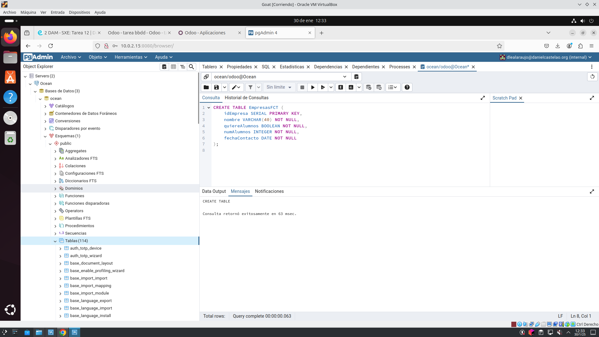
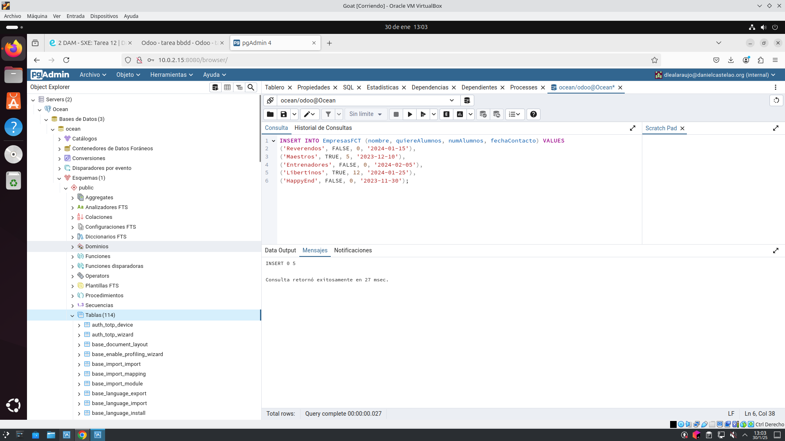
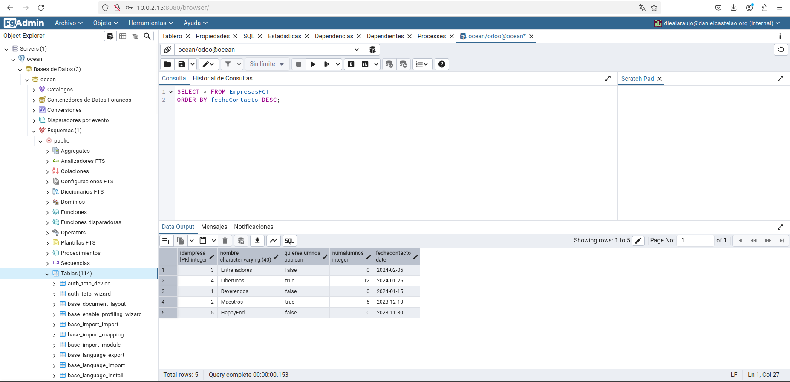
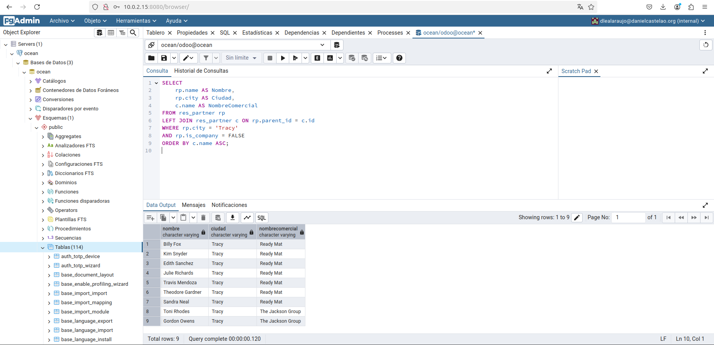
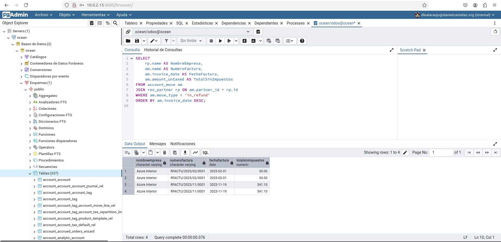
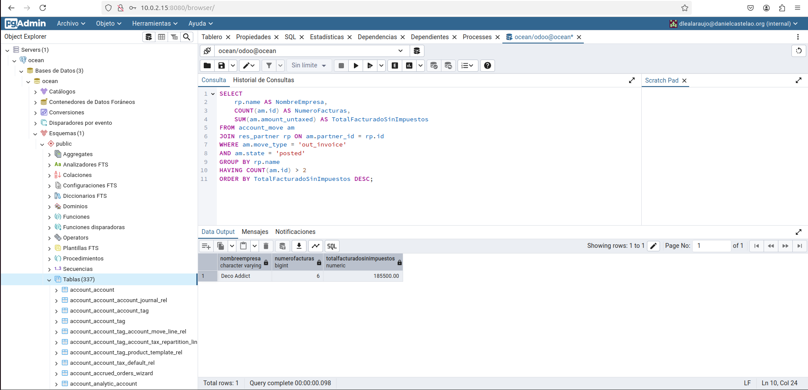

# Tarea_12

## Apartado 1

Accedemos a PgAdmin desde donde hacemos la siguiente query:
```bash
CREATE TABLE EmpresasFCT (
    idEmpresa SERIAL PRIMARY KEY,
    nombre VARCHAR(40) NOT NULL,
    quiereAlumnos BOOLEAN NOT NULL,
    numAlumnos INTEGER NOT NULL,
    fechaContacto DATE NOT NULL
);
```


## Apartado 2

Insertar 5 registros
```bash
INSERT INTO EmpresasFCT (nombre, quiereAlumnos, numAlumnos, fechaContacto) VALUES
('Reverendos', FALSE, 0, '2024-01-15'),
('Maestros', TRUE, 5, '2023-12-10'),
('Entrenadores', FALSE, 0, '2024-02-05'),
('Libertinos', TRUE, 12, '2024-01-25'),
('HappyEnd', FALSE, 0, '2023-11-30');
```


## Apartado 3

Realiza una consulta donde se muestren todos los datos de la tabla EmpresasFCT
ordenados por fechaContacto, de modo que en la primera fila salga el que tenga la
fecha más reciente.
```bash
SELECT * FROM EmpresasFCT 
ORDER BY fechaContacto DESC;
```


## Apartado 4

Realiza una consulta que permita obtener un listado de todos los contactos de  Odoo (no empresas) con la siguiente información: 
- Nombre
- Cuya ciudad sea Tracy 
- Nombre comercial de la empresa
ordenados alfabéticamente por el nombre comercial de la empresa.
```bash
SELECT 
    rp.name AS Nombre,
    rp.city AS Ciudad,
    c.name AS NombreComercial
FROM res_partner rp
LEFT JOIN res_partner c ON rp.parent_id = c.id
WHERE rp.city = 'Tracy' 
AND rp.is_company = FALSE
ORDER BY c.name ASC;
```


## Apartado 5

Utilizando las tablas de odoo, obtén un listado de empresas proveedoras, que han
emitido algún reembolso (facturas rectificativas de proveedor)
- Nombre de la empresa
- Número de factura
- Fecha de la factura
- Total factura SIN impuestos
Ordenadas por fecha de factura de modo que la primera sea la más reciente.

Para esta consulta es necesario instalar la aplicación de facturación en odoo.
```bash
SELECT 
    rp.name AS NombreEmpresa,
    am.name AS NumeroFactura,
    am.invoice_date AS FechaFactura,
    am.amount_untaxed AS TotalSinImpuestos
FROM account_move am
JOIN res_partner rp ON am.partner_id = rp.id
WHERE am.move_type = 'in_refund'
ORDER BY am.invoice_date DESC;

```


## Apartado 6

Utilizando las tablas de odoo, obtén un listado de empresas clientes, a las que se les
ha emitido más de dos facturas de venta (solo venta) confirmadas, mostrando los
siguientes datos:
- Nombre de la empresa
- Número de facturas
- Total facturado SIN IMPUESTOS

```bash
SELECT 
    rp.name AS NombreEmpresa,
    COUNT(am.id) AS NumeroFacturas,
    SUM(am.amount_untaxed) AS TotalFacturadoSinImpuestos
FROM account_move am
JOIN res_partner rp ON am.partner_id = rp.id
WHERE am.move_type = 'out_invoice'
AND am.state = 'posted'
GROUP BY rp.name
HAVING COUNT(am.id) > 2
ORDER BY TotalFacturadoSinImpuestos DESC;
```



